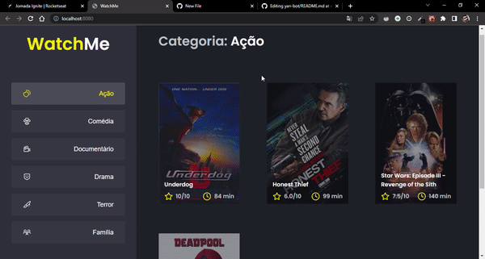

# WatchMe

<p>
  
  
  
  <a href="https://opensource.org/licenses/MIT">
    
  </a>
</p>

<p align="center">
    
</p>


## Tópicos

[Sobre o WatchMe](#sobre-o-WatchMe)

[Tecnologias](#tecnologias)

[Instalação e uso](#instalação-e-uso)

[Licença](#licença)
<br>

## Sobre o WatchMe

 Aplicação onde o principal objetivo foi refatorar uma página para listagem de filmes de acordo com gênero:
- A aplicação possui apenas uma funcionalidade principal que é a listagem de filmes;
- Na sidebar é possível selecionar qual categoria de filmes deve ser listada;
- A primeira categoria da lista (que é "Ação") já deve começar como marcada;
- O header da aplicação possui apenas o nome da categoria selecionada que deve mudar dinamicamente.

## Tecnologias
Tecnologias e ferramentas utilizadas no desenvolvimento do projeto:

- [TypeScript](https://www.typescriptlang.org/)
- [ReactJs](https://pt-br.reactjs.org/docs/getting-started.html)
- [Axios](https://github.com/axios/axios)
- [JSON Server](https://www.npmjs.com/package/json-server)
- [SASS](https://sass-lang.com/)
- [Webpack](https://webpack.js.org/)
- [Babel](https://babeljs.io/)

## Instalação e uso

```bash
# Abra um terminal e copie este repositório com o comando
git clone https://github.com/helton-quintans/desafio02-trilha-react.git
# ou use a opção de download.

# Entre na pasta web com
cd yan-bot

# Instale as dependências
yarn install

# Rode a aplicação
yarn
yarn server
```

<br>

## Licença

<a href="https://opensource.org/licenses/MIT">
    
</a>

<br>

Esse projeto está sob a licença MIT. Veja o arquivo [LICENSE](/LICENSE) para mais detalhes.

---

Feito com :green_heart: by [Helton Quintãns](https://github.com/helton-quintans)

[](https://www.linkedin.com/in/heltonquintans/)
[](mailto:helton.quit@gmail.com)
